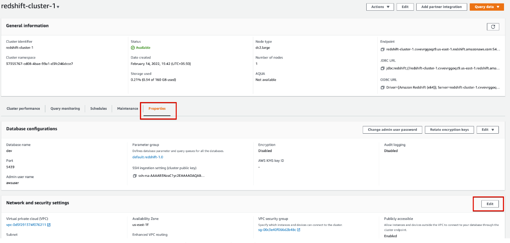

# Project: Data Pipelines with Airflow
## Introduction: 
A music streaming company, Sparkify, has decided that it is time to introduce more automation and monitoring to their data warehouse ETL pipelines and come to the conclusion that the best tool to achieve this is Apache Airflow.

They have decided to bring you into the project and expect you to create high grade data pipelines that are dynamic and built from reusable tasks, can be monitored, and allow easy backfills. They have also noted that the data quality plays a big part when analyses are executed on top the data warehouse and want to run tests against their datasets after the ETL steps have been executed to catch any discrepancies in the datasets.

The source data resides in S3 and needs to be processed in Sparkify's data warehouse in Amazon Redshift. The source datasets consist of JSON logs that tell about user activity in the application and JSON metadata about the songs the users listen to.
## Project Overview

This project will introduce you to the core concepts of Apache Airflow. To complete the project, you will need to create your own custom operators to perform tasks such as staging the data, filling the data warehouse, and running checks on the data as the final step.

We have provided you with a project template that takes care of all the imports and provides four empty operators that need to be implemented into functional pieces of a data pipeline. The template also contains a set of tasks that need to be linked to achieve a coherent and sensible data flow within the pipeline.

You'll be provided with a helpers class that contains all the SQL transformations. Thus, you won't need to write the ETL yourselves, but you'll need to execute it with your custom operators.

In this project, we have 2 different ways to use Airflow:
1. Airflow webserver support by Udacity
2. Airflow localhost with Docker Container.

For project is easier, we can use Airflow webserver but if you want to know how Airflow system is work , you can use docker container to deploy Airflow.
## Prerequisites
- Install Docker and Docker Compose
- Install Anaconda with Python3.9
- Create an IAM User in AWS and  a redshift cluster in AWS
## Datasets
This project need to  working with two datasets :
- Log data: s3://udacity-dend/log_data
- Song data: s3://udacity-dend/song_data
  
## Project Template
To get started with the project:

1. On the project workspace page after the project instructions, you'll find the project template. You can work on your project and submit your work through this workspace. Alternatively, you can download the project template package and put the contents of the package in their respective folders in your local Airflow installation. The project template package contains three major components for the project:
   - The dag template has all the imports and task templates in place, but the task dependencies have not been set
   - The operators folder with operator templates
   - A helper class for the SQL transformations
2. With these template files, you should be able see the new DAG in the Airflow UI. The graph view should look like this:


## Workspace Instructions
### Airflow installation
### 1. Airflow webserver support by Udacity
   - After you have updated the DAG, you will need to run /opt/airflow/start.sh command to start the Airflow webserver.

   

   - Wait for the Airflow web server to be ready (see screenshot below).

   

   - Access the Airflow UI by clicking on the blue "Access Airflow" button.

### 2. Airflow localhost with Docker Container

   - Clone the git repository to local machine
   
   ```
   git clone https://github.com/hoangkhai6893/data_pipeline_airflow
   ```
   - Open the folder git 
   ```
   cd data_pipeline_airflow
   ```
   - Create a conda vitual env. Install python 3.9 in your conda. 
   ```
   conda create --name airflow python=3.9
   ```
   - Active the env
   ```
   conda activate airflow
   ```
   - Install the librarys need for project 
   ```
   pip install -r requirements.txt
   ```
   - Start the Airflow container.
   ```
   docker-compose up --build
   ```

   - Open the UI

   Open the web browser with link :http://localhost:8080
   - Username: airflow
   - Password: airflow
   The Airflow's username and password is setting up in .env file.

## Cluster creation

### Create AWS Redshift
   - Open the AWS console by clicking on the Launch Cloud Gateway button followed the Open Cloud Console button in the classroom


   - Select US West (Oregon) us-west-2 region


   - Search Redshift in the search bar, and then click on Amazon Redshift.


   - Click on Create cluster.


   - Input Cluster Identifier and select Free trial.


   - Input Admin user name. This can be same as the IAM user you created earlier.
 
   - Input Admin user password. Keep the username and password saved locally, as they will be needed in Airflow.
   - Click on Create cluster.
   - On succesful creation of the cluster, you will see Status Available, as shown below:

 

   - Go to redshift-cluster-1. Next, we are going to make this cluster publicly accessible as we would like to connect to this cluster via Airflow.
   - Click on Actions and select Modify publicly accessible setting.
 
   - Click on Enable and Save changes
   
 
   
   - Enable VPC Routing by going to the Properties tab and clicking on Edit button in the Network and Security settings section.

 

   - Enable Enhanced VPC Routing.
 

   - Choose the link next to VPC security group to open the Amazon Elastic Compute Cloud (Amazon EC2) console.

 

   - Go to Inbound Rules tab and click on Edit inbound rules.
 
   - Add an inbound rule, as shown in the image below.
      - Type = Custom TCP
      - Port range = 0 - 5500
      - Source = Anywhere-iPv4
 
   - Now our Redshift cluster should be accessible from Airflow.
   - Go back to the Redshift cluster and copy the endpoint. Store this locally as we will need this while confuguring Airflow.

### Create Airflow Connection
   we'll configure for AWS credentials and connection to Redshift.

   1. Configure for AWS credentials
   - Open the Airflow UI, we have 2 option can chooise.
      - Using the Airflow support by Udacity
      - Your Airflow that is installed in your localhost.

   - Choose Connections then select Create

 
  
   - On the create connection page, enter the following values
      - Connection Id * : Your connection name
      - Connection Type * : Amazon Web Services 
      - Login : Enter your Access key ID from the IAM User credentials
      - Password : Enter your Secret access key from the IAM User credentials
   
   2. Create Connection to Redshift.
 
   Keep going on the connection page, create the new connect to Redshift
      - Connection Id *: Enter redshift.
      - Connection Type *: Enter Postgres.
      - Host: Enter the endpoint of your Redshift cluster
      - Schema: Enter dev. This is the Redshift database you want to connect to.
      - Login: Enter awsuser.
      - Password: Enter the password you created when launching your Redshift cluster.
      - Port: Enter 5439.

